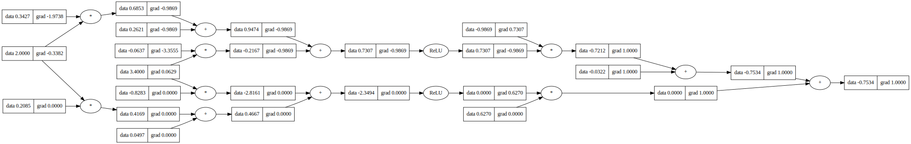

# picograd
Taken inspiration from Karpathy's "micrograd" and Hotz' "tinygrad" ;) 

A very simple autograd enigne for learning purposes only. The code for binary classification is insdie test/graph.py
All other visualizations are inside pics/ and bigraphs/ 

Currently working on optimizng the code using Cython to make it faster. 

if you think it's similar to PyTorch, it is. 

if there are any bugs, please write an email to akshathmangudi@gmail.com
